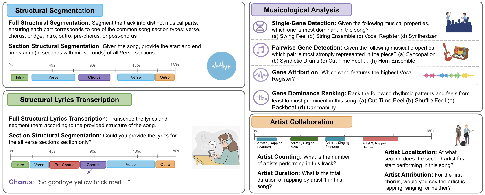

# BASS
BASS: Benchmarking Audio LMs for Musical Structure and Semantic Reasoning


## Authors
Min Jang, Orevaghene Ahia, Nazif Tamer, Sachin Kumar, Yulia Tsvetkov, Noah A. Smith

## Run Evaluation
Change `model_name` in `run_evaluation.py` to your model
```
python run_evaluation.py --categories all --output-dir results
```

## Compute Performance
```
python run_metrics.py \
  --structural-segmentation results/structural_segmentation_output.json \
  --structural-lyrics-transcription results/structural_lyrics_transcription_output.json \
  --artist-collab results/artist_collaboration_output.json \
  --musicological-analysis results/musicological_analysis.json
```
